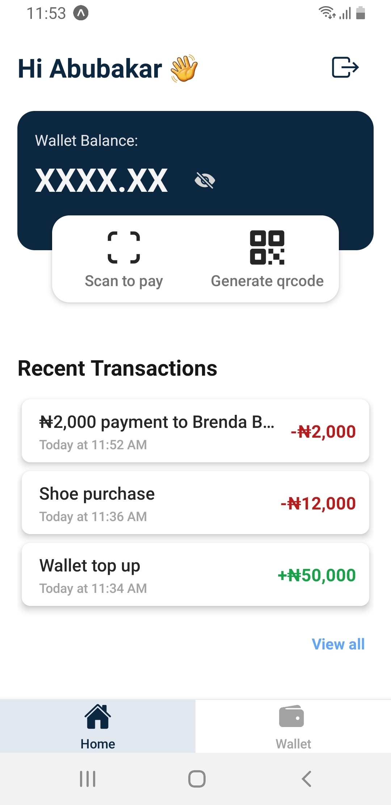

# ScanPay

  <!-- iOS -->
  
  <!-- Android -->
  

This is a demo app that allows payment by scanning a pre-generated qrcode.

## 🚀 How to use

- Run `yarn` or `npm install`
- Run `yarn start` or `npm run start` to try it out.

## 📱 Install on Android

- You can install the .apk build file [build/scanpay.apk](/build/scanpay.apk)
